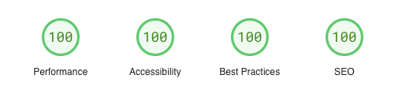

# This is my portfolio and blogging site

This site has been created using Hugo and DecapCMS. The oauth for decapCMS is written to be hosten using vercel functions.

🚀 The site scores 100/100 on [lighthouse](https://pagespeed.web.dev/analysis/https-nipunh-com/dv1jp1sysp?form_factor=desktop).



## How to run this site

1. Clone this repo
2. Install dependencies
   ```bash
   pnpm install
   ```
3. Run the development server
   ```bash
   pnpm dev
   ```
4. Open [http://localhost:4321](http://localhost:4321) with your browser to see the result.
5. Open [http://localhost:4321/admin/index.html](http://localhost:4321/admin/index.html) to see the admin panel.

## How to deploy this site

Follow my these two sections of my blog for deploying this site to production.

1. [Deploying to vercel](https://nipunh.com/blog/modify-static-site-content-easily-from-your-browser#deploying-the-site)
2. [Creating OAuth](https://nipunh.com/blog/modify-static-site-content-easily-from-your-browser#creating-oauth-for-production)
