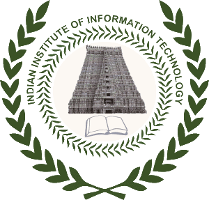

# Nipun Haldar


 Cloud Architect 
 Python Developer 


My role involves architecting scalable and reliable cloud infrastructures tailored to meet the specific needs and goals of my clients. Additionally, I develop custom solutions and automation scripts using Python to streamline processes, enhance efficiency, and drive innovation. From building web applications to creating data processing pipelines, I harness the power of Python to solve complex problems and deliver impactful solutions. My versatile skill set allows me to bridge the gap between cloud architecture and application development, enabling seamless integration across the entire technology stack.

## Skills

|                   |                                                                                      |
| ----------------- | ------------------------------------------------------------------------------------ |
| **Development:**  | AWS, Python, Linux, Docker, Shell, Javascript, Git                                   |
| **Design Tools:** | Figma                                                                                |
| **Soft Skills:**  | Team player Strong communication Problem-solving Attention to detail Time management |

## Work experience




Currently also heading the Cloud infrastructure management and DevOps.

<ul>
  <li>Designed a highly efficient seat allocation algorithm in Python for undergraduate and postgraduate programmes across all major universities in India.</li>
  <li>Successfully planned, developed and deployed cloud infrastructure for CUET in AWS, the second largest exam in India.</li>
  <li>Ensuring uptime of more than 500 in-house SaaS applications.</li>
  <li>Built a blockchain application to disburse 1.2 Lakh digital degrees on blockchain for University of Delhi.</li>
  <li>Created a face detection service to minimize unidentifiable faces in candidate application, saving time during verification.</li>
</ul>




<ul>
  <li>Developed an email service which sends millions of emails per day using AWS Lambda.</li>
  <li>Developed an application to manage and update more than 100 EC2 instances using Ansible.</li>
  <li>Self-hosted GitLab on AWS for our team, making project management more efficient and standardised.</li>
  <li>Developed numerous other services to take the load off of our main application stack and provide better performance.</li>
  <li>Streamlined DevOps processes and developed custom tools to improve internal workflow.</li>
</ul>



Made a chess server with cross-platform user interfaces.

<ul>
  <li>Frontend - React.js and React Native</li>
  <li>Backend - Express.js and socket.io</li>
  <li>Databases - Redis and MongoDB</li>
</ul>




## Education

<section id="education" class="animate space-y-4">
  

    

      
      <h3 class="mb-1 text-xs text-gray-600 dark:text-neutral-400">
        2016-2020
      </h3>
      

        Bachelor's degree in Electronics and Communication Technology
      

      

        Indian Institute of Information Technology, Trichy
      

    

  

</section>
