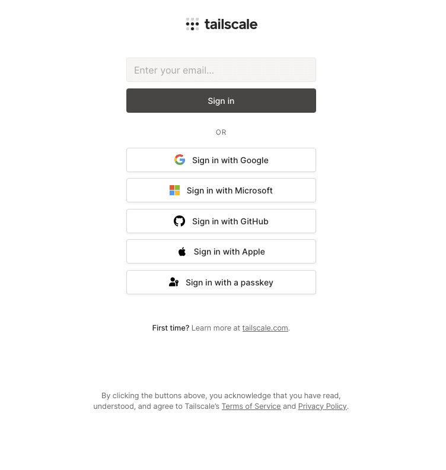

Want to securely access resources on your home network when you are away without the hassle of port forwarding (if its even possible) and setting up a VPN. Then this tutorial is for you. In this tutorial we'll use [Tailscale](https://tailscale.com) to access our network remotely from anywhere in the world!

## Before you begin

1. You'll need a machine on your local network connected to the internet that you want to access remotely.

## Create a Tailscale account

For this to work we'll need a tailscale account. Do not worry it is totally free for the purpose we are using it. Login using Google for easy onboarding and select for personal use.

### Adding your first device

Now, we'll add your first device. You can use the device that
