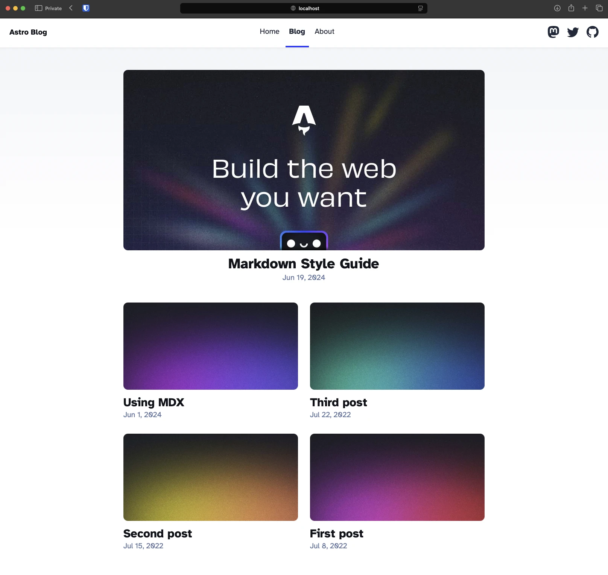
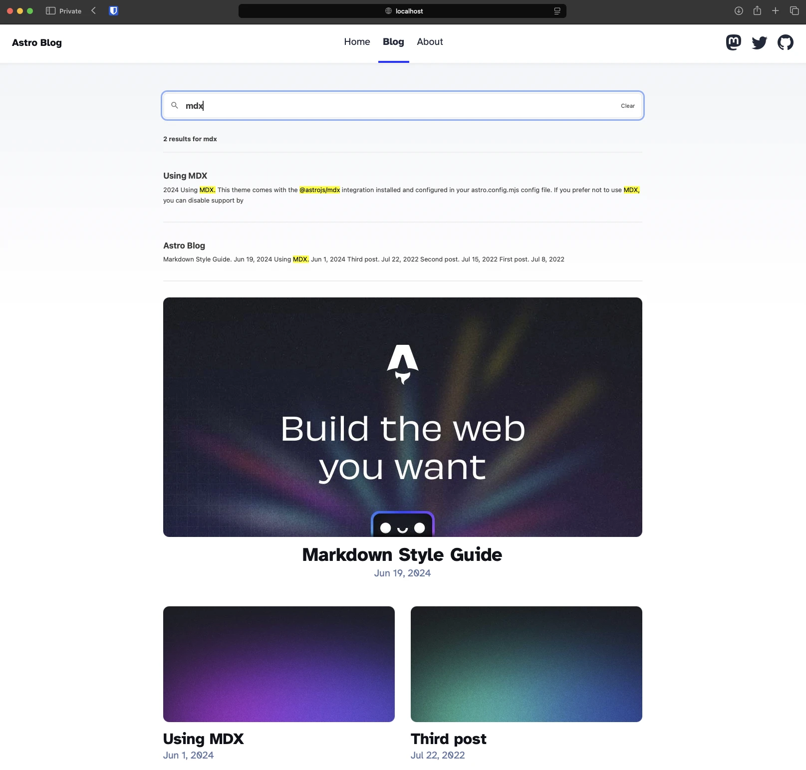

So you've built a site using [Astro](https://astro.build) but can't figure out how to add search functionality to the site without services like Algolia. Fear not in this tutorial we'll add a full text search to any Astro website. It is simple and fast.

We'll use the [Pagefind ](https://pagefind.app)library to implement the search feature in our astro website. You'll need a working astro website. For this tutorial we'll install and use the [astro blog starter template](https://docs.astro.build/en/install-and-setup/).

## Installing packages

We'll install only one library for this tutorial.

```shell
npm i astro-pagefind
```

## Update configuration

Import the package in the `astro.config.mjs`

```javascript
...
import pagefind from "astro-pagefind";
...
```

Also add pagefind in the integrations.

```javascript
...
export default defineConfig({
  site: "https://example.com",
  integrations: [
    ...
    pagefind(),
    ...
  ],
});
...
```

## Add the UI element

We'll add the search bar to the blog page.



Edit `src/pages/blog/index.astro` and add the following code.

```javascript
---
...
import Search from "astro-pagefind/components/Search";
...
---

...
<div style="margin-bottom: 2rem;">
  <Search id="search" className="pagefind-ui" uiOptions={{ showImages: false }} />
</div>
...
```

Now, you'll be able to see the search bar in the blog page.

## Generating the search index

If you try to search you won't be abe to see any results now because the search does not work in the development mode. To make it the search work development mode we need to build the site once. Then we can use the search in the development mode also.

```shell
npm build
npm run dev
```

Now, search for ay blog. You'll be able to full text search on any page.



**Woohoo!!🥳 Search is now working on your astro site.**
