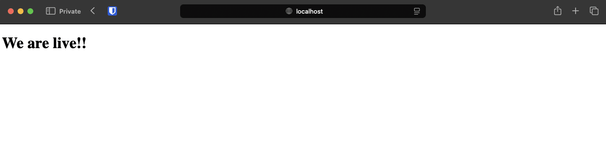
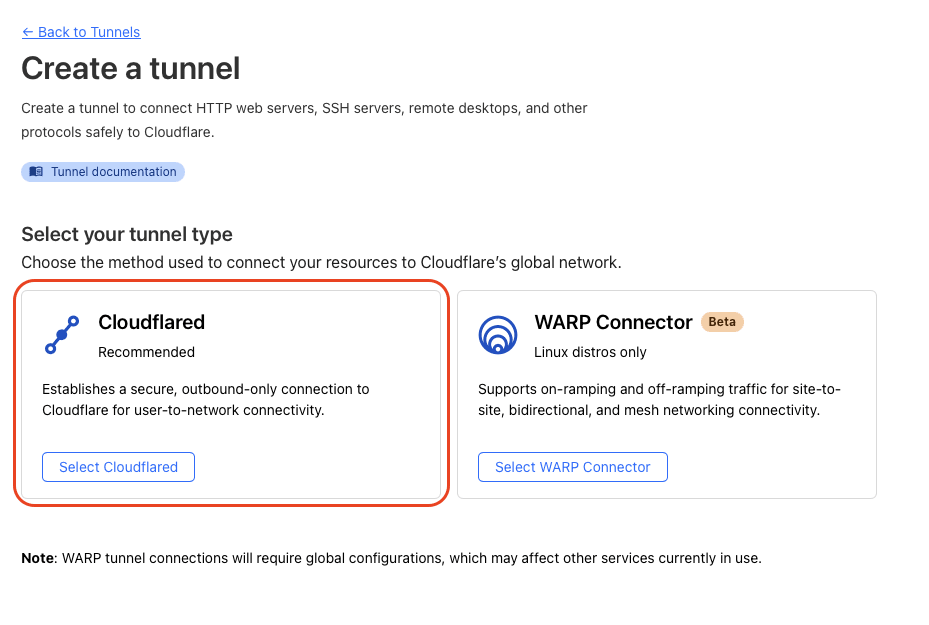
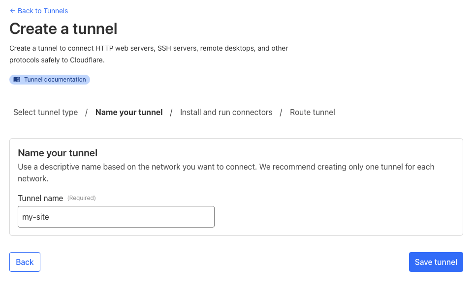
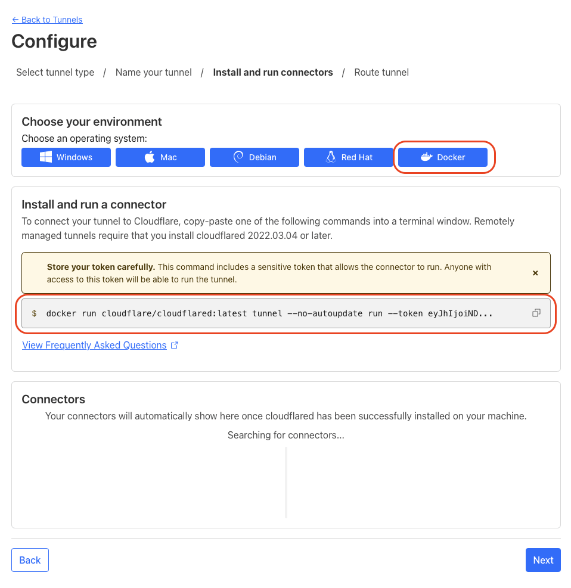
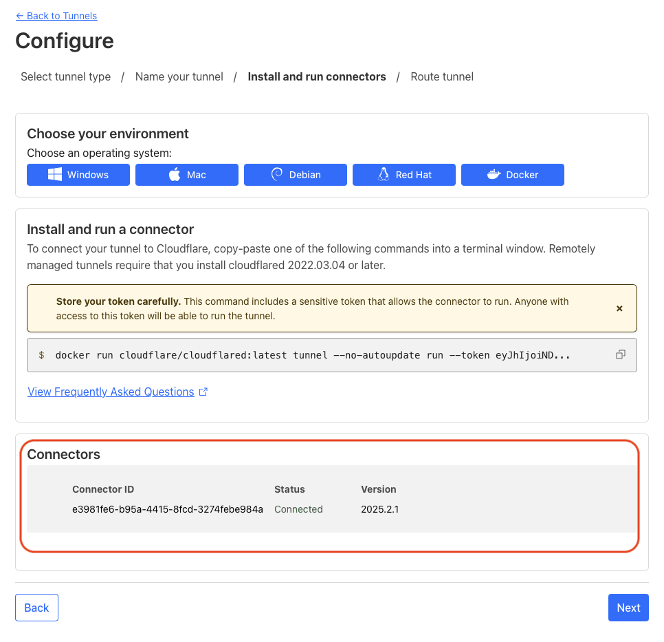
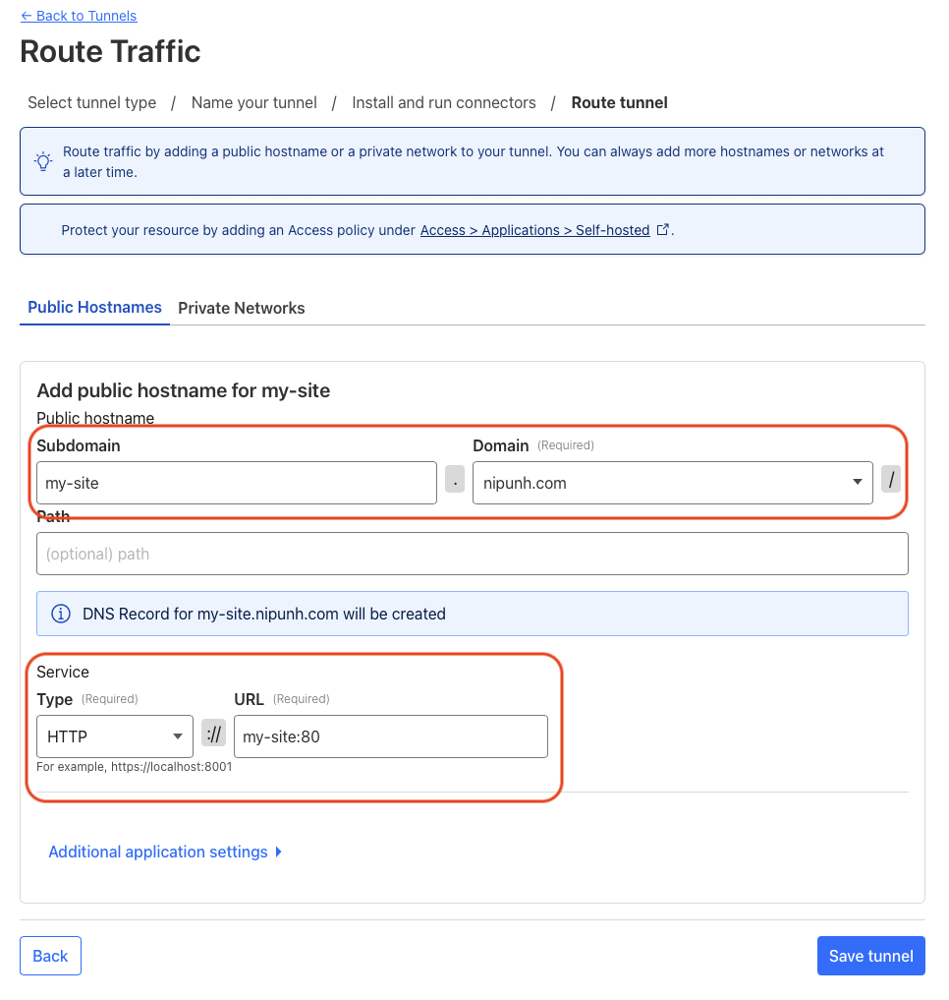
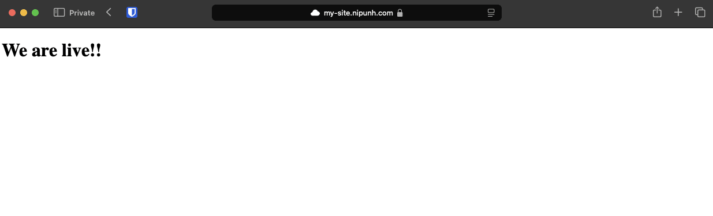

Wanting to host a website of your own but do not want to pay for servers or do not have a static public IP address. Yes you can probably use any other free services to achieve this and will probably get great uptime but where's the fun in that right? You just need a domain to get started and expose any application to the internet for free!

Let's get started!

## Before you begin

1. A machine with docker installed (preferably a UNIX based system).
2. A domain that you own (you can get a .tk domain name for free).
3. Basic knowledge about DNS settings.

## Setting up Docker

[Install docker](https://docs.docker.com/engine/install/) on a machine that you want to host your site on. Make sure this machine is connected to the internet (preferably using a ethernet cable) and any sleep settings are turned off if you are using a laptop. Just make sure that this machine is always on connected to the internet. For this tutorial we'll be host a simple webpage but this can be extended to any web application.

Create a folder named `my-site` on your machine that you installed docker.

```shell
mkdir my-site
cd my-site
```

Now we create a landing page for our site inside `my-site/public/index.html`

```html
<!DOCTYPE html>
<html lang="en">
  <head>
    <meta charset="UTF-8" />
    <meta name="viewport" content="width=device-width, initial-scale=1.0" />
    <title>Document</title>
  </head>

  <body>
    We are live!!
  </body>
</html>
```

Next we need to create a file named `compose.yml` this will contain the docker configuration. For this example we are using only two containers nginx and cloudflare. But you can use as many as required by your application like MySQL, redis etc.

```yaml
services:
  my-site:
    image: nginx:mainline-alpine-slim
    container_name: my-site
    restart: on-failure
    ports:
      - 8080:80
    volumes:
      - ./public:/usr/share/nginx/html/:ro
```

The folder structure should look like this:

```
📦my-site
 ┣ 📂public
 ┃ ┗ 📜index.html
 ┗ 📜compose.yml
```

Now run the container to see if everything works on you local machine.

```shell
docker compose up -d
```

Navigate to `http://localhost:8080` on your machine and you'll be able to see the site.



## Setting up Cloudflare

You should use Cloudflare's nameservers for this to work. If you are not [switch your nameservers to cloudflare](https://developers.cloudflare.com/dns/zone-setups/full-setup/setup/).

Now on cloudflare's dashboard go to **Zero Trust > Networks > Tunnels > Create a tunnel.** Select cloudflared as the tunnel type.



Next, give your tunnel a name.



In the configure section, copy the token from the docker command.



## Setting up the tunnel

Now edit the `compose.yml` file to include the cloudflare tunnel.

```yaml
services:
  cf-tunnel:
    image: cloudflare/cloudflared:latest
    container_name: cf-tunnel
    restart: on-failure
    command: "tunnel --no-autoupdate run --token ${CF_TOKEN}"

  my-site:
    depends_on:
      - cf-tunnel
    image: nginx:mainline-alpine-slim
    container_name: my-site
    restart: on-failure
    ports:
      - 8080:80
    volumes:
      - ./public:/usr/share/nginx/html/:ro
```

> If you are facing low transfer speeds through your tunnel you can add the following to command `--protocol h2mux`

Also create a .env file to store the token

```ini
CF_TOKEN=<your-cloudflare-token>
```

Now, run the new docker configuration.

```shell
docker compose up -d
```

If everything worked you should see the connector in the cloudflare tunnel page.



Next we have to configure the domain (or subdomain) that we want to map to this tunnel. For this tutorial I have kept the subdomain as my-site but you can leave it blank if you want to host this site at the root domain. In the service use HTTP for protocol and my-site:80 as the URL. Replace my-site with the container name in your compose.yml file.



Click **Save Tunnel** and open the domain you just configured in the tunnel.



**Hurray!🎉 You are live from your home.**
