Homelab is the name given to the server(s) that reside locally in your home that you can use for various functions such as virtualization, testing, NAS, media server etc. This server can be a raspberry pi, an old pc/laptop or any other computer.

## The homelab architecture

### The server

For my homelab server I use an [Asrock Deskmeet x300](https://www.asrock.com/nettop/AMD/DeskMeet%20X300%20Series/index.asp), it is a mini ITX barebone unit. It is a great fit for a homelab due to its compact size. The specs are:

* **CPU:** Ryzen 7 5700G
* **RAM:** 64GB
* **Storage:**

  * Internal - 500GB + 4TB
  * External - 4TB + 1TB
  * Network Attached Storage - 1TB

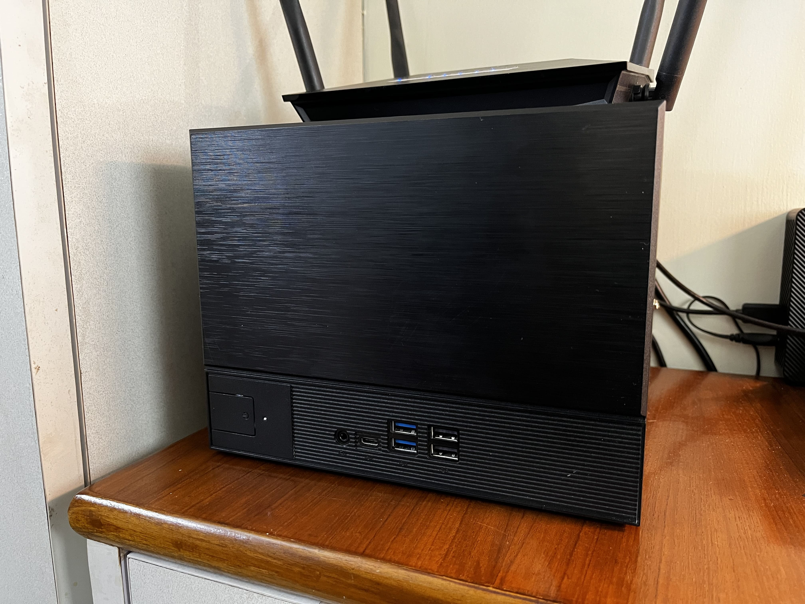

### Storage

Storage is an important part of any homelab. For me, I am using it as a media server, photos and drive. So I have a lot of storage for this data as well as for backups.

* **Internal 1:** This is a [Crucial P3 500GB M.2 drive](https://amzn.to/4la3gqk). It is used as the OS drive for the hypervisor and all the VMs.
* **Internal 2:** This is a [Seagate Ironwolf 4TB](https://amzn.to/4hTktSd) hard drive and is used to store everything.
* **External 1:** This is a [Seagate 4TB external hard drive](https://amzn.to/4i0MxDc). This is the backup drive. All important stuff is backed up to this drive daily.
* **External 2:** This is a 1TB [drive](https://amzn.to/3RAxEMR) from an old computer housed in a [SATA to USB enclosure](https://amzn.to/3XByywf). It is used as my time machine backup disk.
* **NAS:** It's a [Synology NAS](https://amzn.to/3E2Rv4k) with a 1TB drive from another old computer. This stores the backup of all my VMs.

### Architecture

This is a high level architecture of my homelab.

## Services Running

All of the services that I am running are through [Docker](https://www.docker.com) on Debian VMs. This enables easy onboarding and testing of these services and does not leave residue after uninstallation.

### Utilities

#### Nginx Proxy Manager [🔗](https://nginxproxymanager.com)

When starting out you can access your homelab resources with the ip and port combination but it gets very difficult to remember all the ips and ports to your service. Moreover, some services require you to run over SSL. Nginx Proxy Manager provides an easy to use GUI for nginx to be used as reverse proxy and handles SSL as well.

#### Adguard [🔗](https://adguard.com/en/welcome.html)

We use adblock on your browsers but that's it, there is not option to block ads from other resources like on a smart TV or OS level telemetry. This is where a DNS based adblock like Adguard comes into play. It serves two purposes. Firstly, It blocks DNS queries to the Ad services essentially blocking the ad providing a network wide adblock. And second, it provides internal DNS records to my local resources. You just have to change the DHCP settings on your router to use adguard as the DNS server.

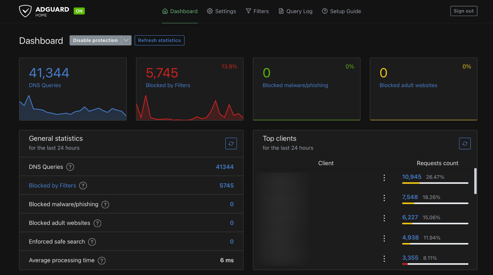

#### Vaultwarden [🔗](https://github.com/dani-garcia/vaultwarden)

Creating a strong password for every site and then remembering it is not humanly possible. That is where password managers come in, but they are not free or very limited in their free tier. Vaultwarden is an alternative implementation of the Bitwarden Client API, written in Rust and compatible with the official bitwarden clients.

#### It-tools [🔗](https://github.com/CorentinTh/it-tools)

Want to convert markdown to HTML, hash a piece of text, convert hex to rgb, prettify JSON etc? This is collection of all these tools and many more in a single application. No need to go to different sites or download multiple tools. I have a self hosted version of this [here](https://tools.nipunh.com).

#### Speedtest tracker [🔗](https://github.com/alexjustesen/speedtest-tracker)

It is simply a internet speedtest on a schedule. It can also send notifications when the speed is lower than a certain threshold.

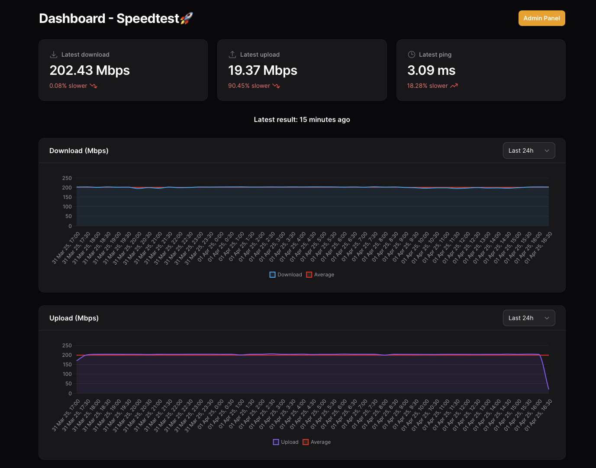

#### OpenMedia vault [🔗](https://www.openmediavault.org)

Managing storage and backups in a homelab is a very crucial part. I have Open Media Vault (OMV) running in a VM that is used to centrally manage all the storage. OMV exposes network shares which can be mounted by other VMs and systems on my network. As all storage is now centralised I can easy backup this to the external hard drive using a software called [borg backup](https://www.borgbackup.org). OMV also exposes the 1TB external hard drive as a samba share to be used time machine backup for my mac.

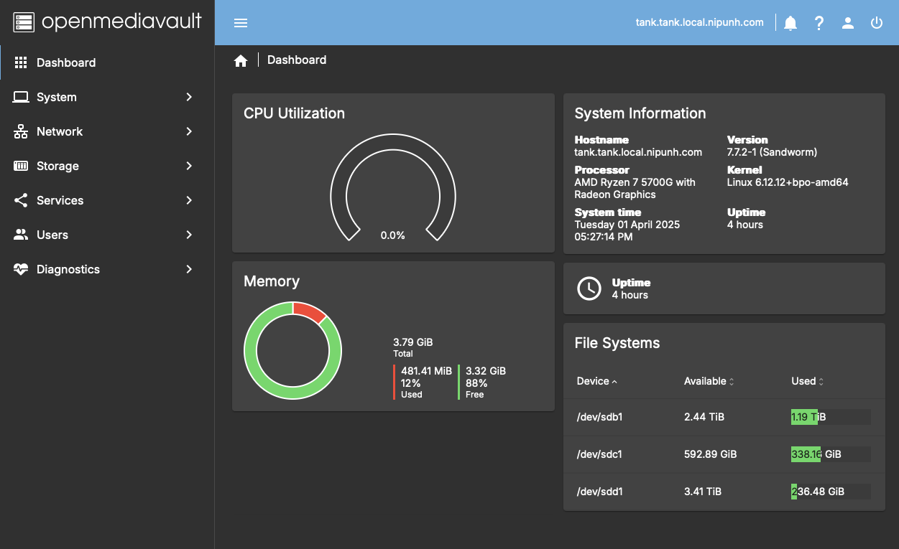

#### Code Server [🔗](https://github.com/coder/code-server)

Write code from anywhere on VS Code from your browser. No need to install dependencies on your device. You can install this on a separate VM and get full access like you would in SSH.

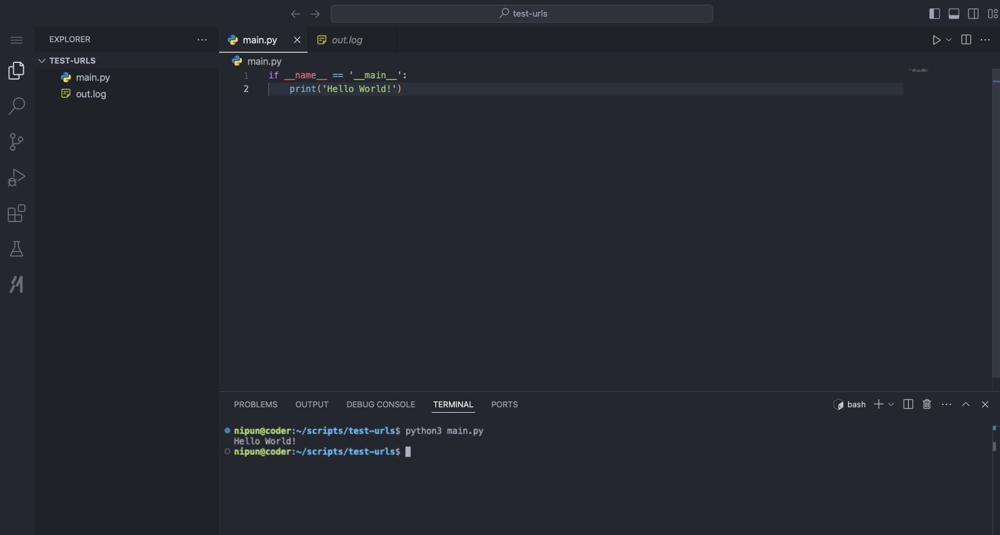

#### Home Assistant [🔗](https://www.home-assistant.io)

Are you using smart devices in your house but are having to manage them though different apps. Home Assistant is an opensource home automation tool. It is very powerful can be integrated with a variety of a smart devices to create automations around it. I mainly use it to turn on/off lights on a schedule and monitor the cameras outside my house. But it can do far more than this.

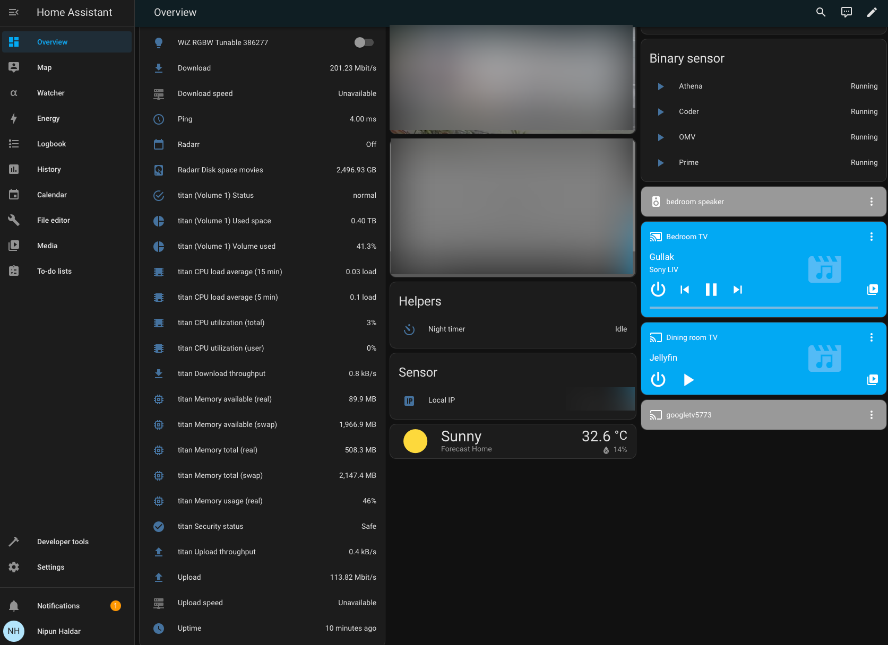

#### Uptime Kuma [🔗](https://github.com/louislam/uptime-kuma)

Homelab services do not provide high uptime as the cloud counterparts, its not a huge problem as it caters only to you and a few other and not thousands or millions of people. But what is important is that you should be able to know when a service is down. This is what Uptime Kuma does, it regularly pings your services and notifies you if any of them goes down.

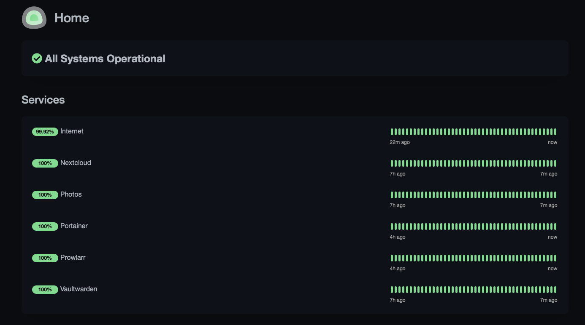

As this is also hosted in my homelab and prone to downtime, so in addition I also use UptimeRobot. These are both very similar but uptimerobot is a service on cloud so it gives better uptime. You can see my current uptime [here](https://stats.uptimerobot.com/UKE6B7GVT8).

#### Portainer [🔗](https://www.portainer.io)

So now you have all these services running through docker but what if you need to restart a service or check for logs? You have to go to the homelab server and run docker commands to do so. Not anymore, use portainer for a GUI to quickly manage all the docker containers you are running.

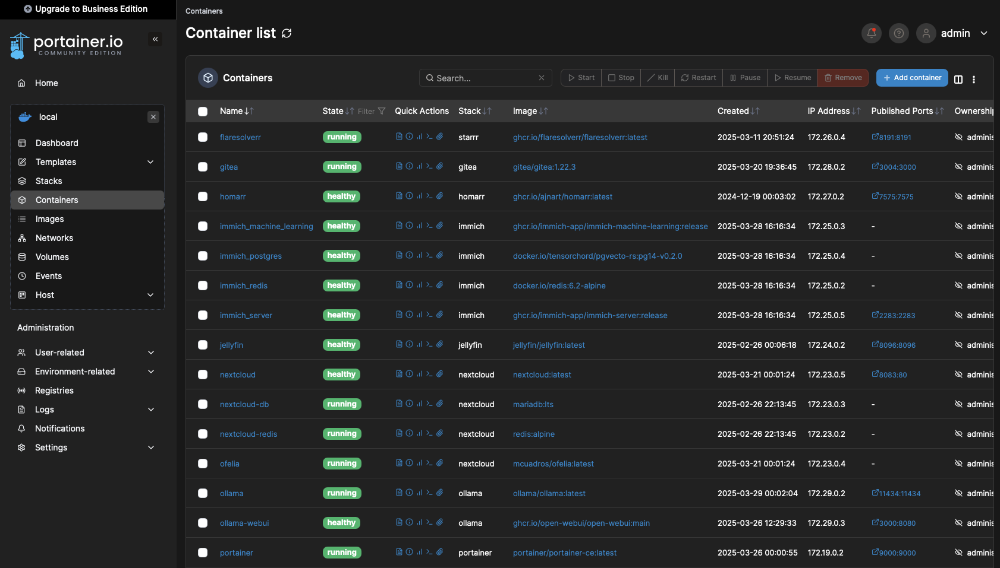

#### Twingate [🔗](https://www.twingate.com)

Now we are running all these services on our homelab in our local network and all works fine when we are at home. But what happens if you are not. You can either port forward your services and make them public (security nightmare!! and not even possible for some ISPs) or you can use a VPN (low security risks but still not a feasible way for all ISPs). Twingate can be used no matter what is your use case. It is a VPN which can be setup with zero configuration.

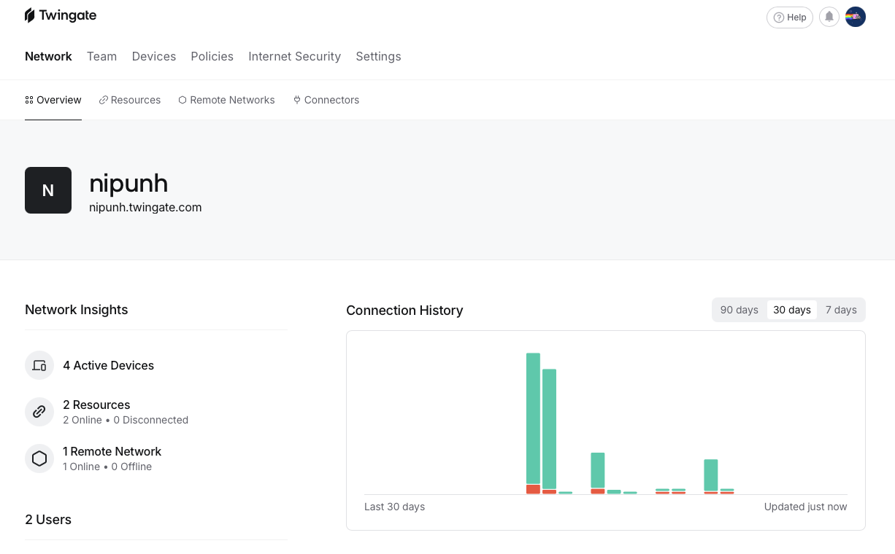

### Productivity

#### Nextcloud [🔗](https://nextcloud.com)

Nextcloud is a very well built google workspace alternative. It has all the features of google workspaces like drive, meet, calendar, mail inbox any much more. You can save a lot of money by self hosting nextcloud instead of paying for google drive.

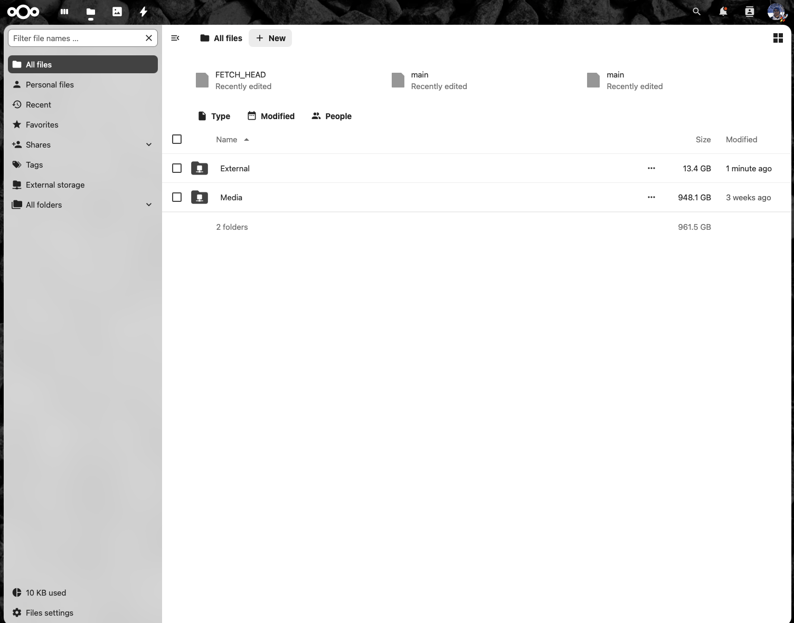

#### Immich [🔗](https://immich.app)

Most of us are either paying for icloud or google photos to backup photos. Not anymore, self host immich to fully replace any cloud photos backup. Unlike other alternative it has a very nice and easy to use UI too.

#### Gitea [🔗](https://about.gitea.com)

We all have used github, but you need to remove all your secrets from the commits before pushing. A local github alternative might be useful incase you just need to keep all your files as is with secrets also. I use gitea as my local git server, all the git features work as expected and it has a nice UI to view your code.

#### Homarr [🔗](https://homarr.dev)

Keeping track of all these services becomes a hassle when you have a quite a few like me. Homarr provides a pretty dashboard where you can add all your services and look at them at a quick glance. It also provices API integration with these services to show widgets.

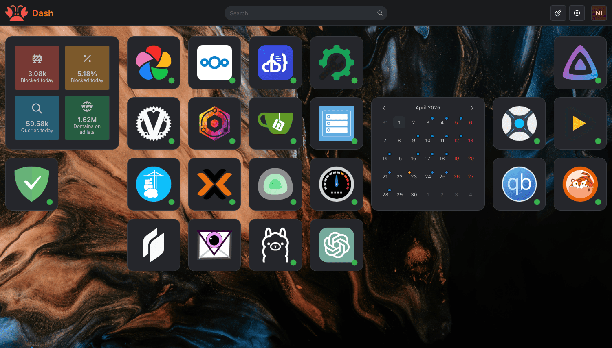

#### Ollama [🔗](https://ollama.com/library/gemma3) with [OpenWebUI](https://openwebui.com)

LLMs like ChatGPT are very popular these days. It can be useful in many tasks but what about privacy. And due to high demand chatgpt is down sometimes too. You can [host your local LLM](/blog/how-to-host-a-local-llm-model) to use as your personal private chatbot.

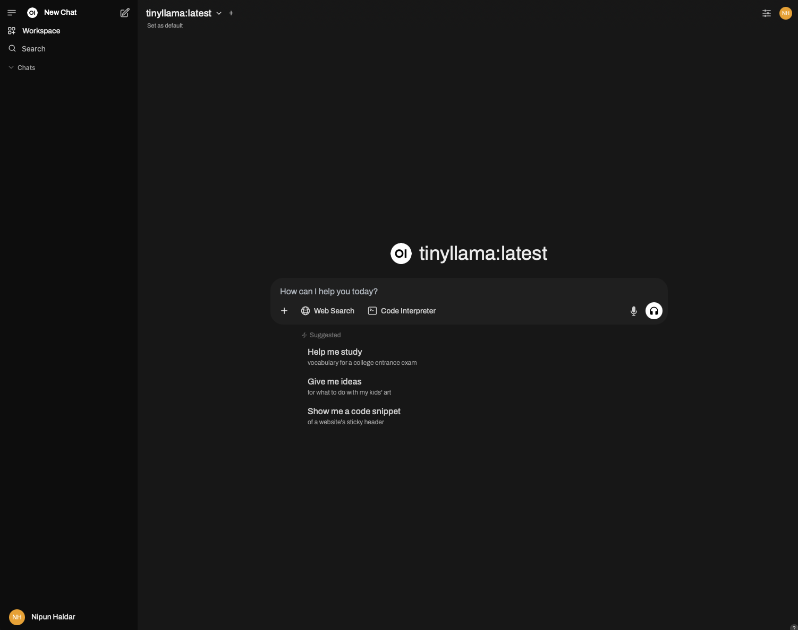

### Entertainment

#### Jellyfin [🔗](https://jellyfin.org)

Jellyfin is a media server. It organises all your downloaded media with the correct metadata and provides a web UI for playback.

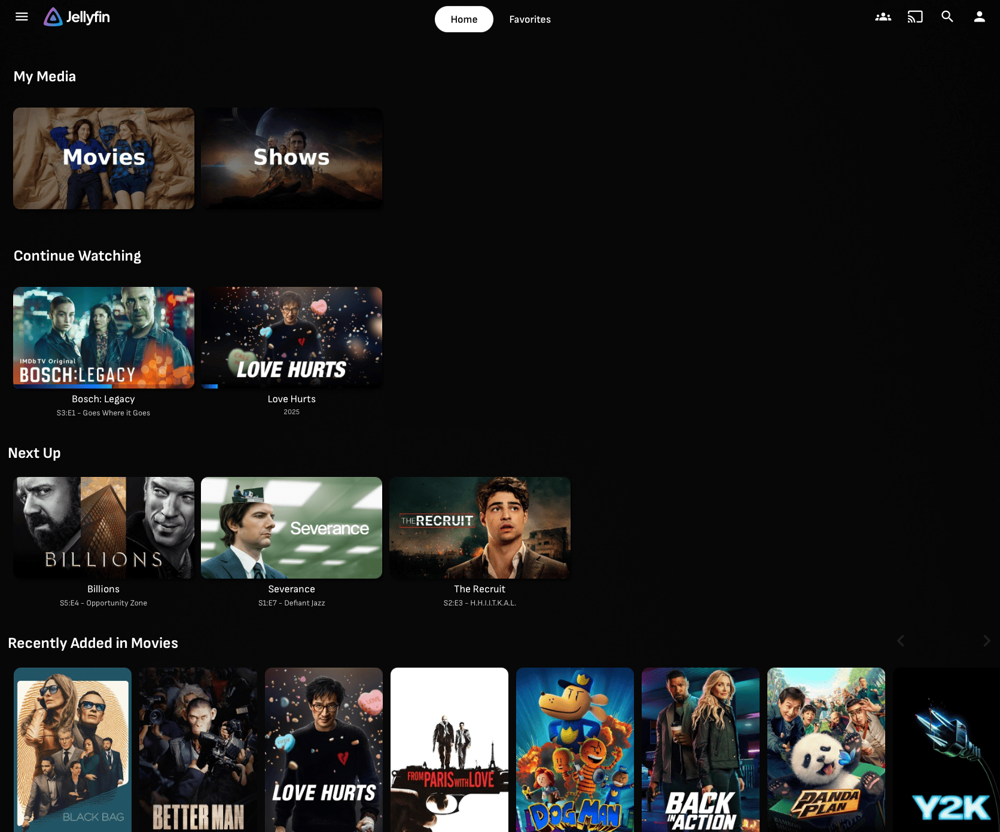

#### \*arr Stack [🔗](https://wiki.servarr.com)

Paying for multiple OTT subscriptions. Save money by hosting the *arr stack. I host [sonarr](https://sonarr.tv), [radarr](https://radarr.video) and [prowlarr](https://prowlarr.com) in my homelab. You'll also need to host a download client with these like [qBittorrent](https://docs.linuxserver.io/images/docker-qbittorrent/).

You'll still need to manually add the shows and movies which can be a hassle. To fully automate this you can use [listrr.pro](https://listrr.pro) to create lists of movies and shows using filters. You can use my custom lists as a starting point: [Movies](https://listrr.pro/Lists/ShowMovieList/6726592c8e1c7df1624485ad) and [Shows](https://listrr.pro/Lists/ShowShowList/67346e00ad3213fedc8bf15c).
